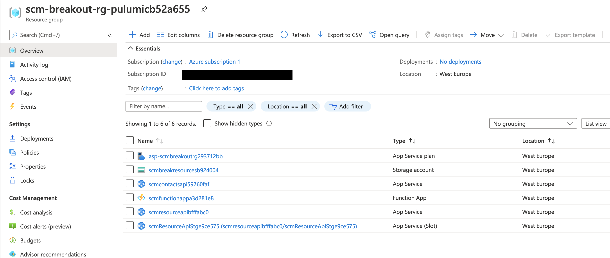

# azure-training-pulumi
azuredevcollege/trainingdays scm breakout app infrastructure with Pulumi


I wanted to do a quick setup with Pulumi in order to see how fast I would be in contrast to use ARM templates in this session: https://github.com/azuredevcollege/trainingdays/blob/master/day2/challenges/challenge-bo-3.md

Until now I invested around 1h for this...

[](https://asciinema.org/a/385771)

## SCM Breakout App infrastructure with Pulumi

https://www.pulumi.com/docs/get-started/azure/
```shell
mkdir scmbreakoutpulumi  && cd scmbreakoutpulumi
pulumi new azure-typescript
```

#### Storage Account

https://www.pulumi.com/docs/reference/pkg/azure/storage/

https://www.pulumi.com/docs/reference/pkg/azure/storage/account/

###### Container

https://www.pulumi.com/docs/reference/pkg/azure/storage/container/

#### App Service

https://www.pulumi.com/docs/reference/pkg/azure/appservice/appservice/


#### FunctionApp

We don't have a Function in the setup, we have

https://github.com/pulumi/examples/blob/master/azure-ts-functions-raw/index.ts

The setup uses a `azure.appservice.FunctionApp` !

https://www.pulumi.com/docs/reference/pkg/azure/appservice/functionapp/


Have a look into the Azure Portal

