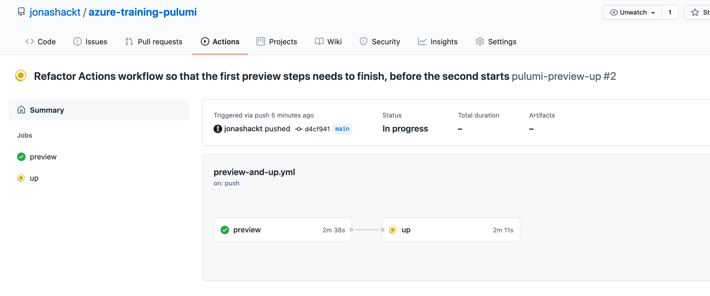

# azure-training-pulumi
[](https://github.com/jonashackt/azure-training-pulumi/actions)
[](https://github.com/jonashackt/azure-training-pulumi/blob/master/LICENSE)
[](https://renovatebot.com)

azuredevcollege/trainingdays scm breakout app infrastructure with Pulumi


I wanted to do a quick setup with Pulumi in order to see how fast I would be in contrast to use ARM templates in this session: https://github.com/azuredevcollege/trainingdays/blob/master/day2/challenges/challenge-bo-3.md

Until now I invested around 1h for this...

[](https://asciinema.org/a/385869)

## SCM Breakout App infrastructure with Pulumi

https://www.pulumi.com/docs/get-started/azure/
```shell
mkdir scmbreakoutpulumi  && cd scmbreakoutpulumi
pulumi new azure-typescript
```

#### Storage Account

https://www.pulumi.com/docs/reference/pkg/azure/storage/

https://www.pulumi.com/docs/reference/pkg/azure/storage/account/

###### Container

https://www.pulumi.com/docs/reference/pkg/azure/storage/container/

###### Queues

https://www.pulumi.com/docs/reference/pkg/azure/storage/queue/

#### App Service

https://www.pulumi.com/docs/reference/pkg/azure/appservice/appservice/

###### Slots

https://www.pulumi.com/docs/reference/pkg/azure/appservice/slot/


#### FunctionApp

We don't have a Function in the setup, we have

https://github.com/pulumi/examples/blob/master/azure-ts-functions-raw/index.ts

The setup uses a `azure.appservice.FunctionApp` !

https://www.pulumi.com/docs/reference/pkg/azure/appservice/functionapp/


## Architecture of the app

See https://github.com/azuredevcollege/trainingdays/blob/master/day2/challenges/challenge-bo-3.md (all kudos go there!)


Have a look into the Azure Portal


## Pulumi with GitHub Actions

https://www.pulumi.com/docs/guides/continuous-delivery/github-actions/

It's really cool to see that there's a Pulumi GitHub action project https://github.com/pulumi/actions already ready for us.

#### Create needed GitHub Repository Secrets

First we need to create 5 new GitHub Repository Secrets (encrypted variables) in your repo under `Settings/Secrets`.

We should start to create a new Pulumi Access Token `PULUMI_ACCESS_TOKEN` at https://app.pulumi.com/jonashackt/settings/tokens

Now we need to create the Azure specific variables (see the docs https://github.com/pulumi/actions#microsoft-azure):

`ARM_SUBSCRIPTION_ID`

For the other 3 variables we need to create a new Azure Service Principal (https://www.pulumi.com/docs/intro/cloud-providers/azure/setup/#creating-a-service-principal), which [is the recommended way](https://www.pulumi.com/docs/intro/cloud-providers/azure/setup/#service-principal-authentication):

> Using a Service Principal is the recommended way to connect Pulumi to Azure in a team or CI setting.

To create a Service Principal with Azure CLI [the docs tell us](https://docs.microsoft.com/de-de/cli/azure/create-an-azure-service-principal-azure-cli) to: 

```shell
az ad sp create-for-rbac --name servicePrincipalGitHubActions
```

Now from the output choose the `appId` as the `ARM_CLIENT_ID`, the `password` as the `ARM_CLIENT_SECRET` and the `tenant` as the `ARM_TENANT_ID`. Create them all as GitHub Repository Secrets.

Finally there should be all these vars defined:


#### Create GitHub Actions workflow

Let's create a GitHub Actions workflow [preview-and-up.yml](.github/workflows/preview-and-up.yml):

```yaml
name: pulumi-preview-up

on: [push]

env:
  ARM_SUBSCRIPTION_ID: ${{ secrets.ARM_SUBSCRIPTION_ID }}
  ARM_CLIENT_ID: ${{ secrets.ARM_CLIENT_ID }}
  ARM_CLIENT_SECRET: ${{ secrets.ARM_CLIENT_SECRET }}
  ARM_TENANT_ID: ${{ secrets.ARM_TENANT_ID }}
  PULUMI_ACCESS_TOKEN: ${{ secrets.PULUMI_ACCESS_TOKEN }}

jobs:
  preview:
    runs-on: ubuntu-latest
    steps:
      - uses: actions/checkout@v2

      - uses: pulumi/actions@v2
        with:
          command: preview
          stack-name: github-$GITHUB_RUN_ID

  up:
    runs-on: ubuntu-latest
    needs: preview
    steps:
      - uses: actions/checkout@v2

      - uses: pulumi/actions@v2
        with:
          command: up
          stack-name: github-$GITHUB_RUN_ID

  destroy:
    runs-on: ubuntu-latest
    needs: up
    steps:
      - uses: actions/checkout@v2

      - uses: pulumi/actions@v2
        with:
          command: destroy
          stack-name: github-$GITHUB_RUN_ID

```

We use the possibility [to define the environment variables on the workflow's top level](https://docs.github.com/en/actions/reference/environment-variables) to reduce the 3 definition to one. Also we define a `stack-name` containing the `GITHUB_RUN_ID` which is one of [the default GHA environment variables](https://docs.github.com/en/actions/reference/environment-variables#default-environment-variables) which is defined as:

> A unique number for each run within a repository. This number does not change if you re-run the workflow run.

With this we prevent [Action workflows getting in each other's way like this](https://github.com/jonashackt/azure-training-pulumi/runs/1977168868?check_suite_focus=true):

```shell
Updating (dev)

error: [409] Conflict: Another update is currently in progress.
To learn more about possible reasons and resolution, visit https://www.pulumi.com/docs/troubleshooting/#conflict

```


Using this simply workflow, the first `preview` job needs to finish successfully before the `up` job starts:



And we finally destroy our stack also, so that we don't procude to much costs :)

Don't forget to craft a nice GitHub Actions badge!

```
[](https://github.com/jonashackt/azure-training-pulumi/actions)
```

Optionally you can also install the Pulumi GitHub App so see more insights integrated in the commit history:

https://www.pulumi.com/docs/guides/continuous-delivery/github-app/


## TODO

* Application Insights?